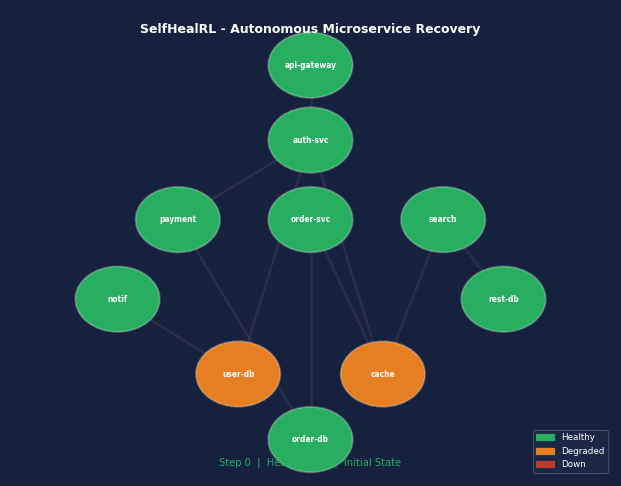

# 🏥 SelfHealRL — Autonomous Microservices Recovery

> **An RL agent that autonomously diagnoses and fixes cascading failures in a 10-service microservice mesh — no human rules, no manual intervention.**

[](https://python.org)
[](https://gymnasium.farama.org)
[](https://stable-baselines3.readthedocs.io)
[](https://huggingface.co/spaces/revti126/selfheal-rl-demo)
[](LICENSE)

---

## 🏆 Hackathon Results

| Task | Score | Threshold | Status |
|:-----|:-----:|:---------:|:------:|
| task_easy — Single Fault Recovery | **0.9000** | ≥ 0.70 | ✅ PASS |
| task_medium — Cascade Recovery | **0.8100** | ≥ 0.60 | ✅ PASS |
| task_hard — Multi-Fault Recovery | **0.7241** | ≥ 0.50 | ✅ PASS |
| **Overall (LLM Baseline)** | **0.8114** | | ✅ ALL PASSED |

**[🎮 Try the Live Demo](https://huggingface.co/spaces/revti126/selfheal-rl-demo)** · **[📖 API Docs](https://revti126-selfheal-rl.hf.space/docs)**



---

## 🚨 The Problem

In production, microservice failures **cascade** — one database crash takes down auth, which kills the API gateway, which drops the entire platform. On-call engineers must:

1. **Diagnose** — which service is the root cause?
2. **Prioritize** — fix upstream dependencies first
3. **Choose** — restart? rollback? scale up? reroute?
4. **Act fast** — every minute of downtime costs revenue

SelfHealRL trains an RL agent to do all of this **autonomously**, learning purely from experience with no hand-coded rules.

---

## 🧠 Why RL — Not Just Rules?

A heuristic agent with 20 hand-coded rules works for known failures. But real systems have:
- **Unknown failure patterns** that evolve over time
- **Hundreds of services** — writing rules for all combinations is impossible
- **Changing environments** — a trained RL agent adapts, rules don't

The LSTM-based RL agent **discovers** the fix-upstream-first strategy on its own through 1.25M steps of trial and error — the same way AlphaZero learned chess without being told any rules.

---

## 🏗️ Architecture

```
┌──────────────────────────────────────────────────────┐
│               Service Mesh (10 services)              │
│                                                      │
│  api-gateway → auth-service → user-db                │
│                    ↓          cache-layer            │
│  payment-service → order-db                          │
│  order-service  → order-db, cache-layer              │
│  search-service → restaurant-db, cache-layer         │
│  notification-service → user-db                      │
└──────────────────────────────────────────────────────┘
           ↕ 104-dim observation vector
   ┌──────────────────┐        ┌─────────────────┐
   │  RecurrentPPO    │        │   Reward Signal  │
   │  LSTM (128 units)│ ←────→ │  10 components   │
   │  Action Masking  │        │  +recovery/−waste│
   └──────────────────┘        └─────────────────┘
           ↓ 60 discrete actions (6 types × 10 services)
   restart | scale_up | reroute | rollback | observe | do_nothing
```

---

## ✨ Key Innovations

### 1. RecurrentPPO + LSTM Memory
Under partial observability, the agent must remember what it diagnosed 3 steps ago. An MLP forgets everything each step. Our LSTM (`hidden_size=128`) carries memory across the episode.

### 2. Action Masking
Masks out illegal actions (e.g., restart a healthy service, re-observe an already-observed service) — reduces effective action space by ~50%, dramatically speeding up learning.

### 3. Shaped 104-dim Observation
Beyond raw metrics, the agent sees:
- `has_unmet_deps` — is this service's upstream still down?
- `steps_since_observed` — how stale is this service's data?
- `estimated_failure_type` — CPU/memory pattern inference

### 4. 4-Phase Curriculum Learning
```
Phase 1: EASY   (50k steps,  full obs)    → learn basic recovery
Phase 2: MEDIUM (100k steps, full obs)    → handle cascades
Phase 3: HARD   (500k steps, partial obs) → multi-fault + memory
Phase 4: CHAOS  (600k steps, partial obs) → extreme scenarios
```
Mixed difficulty replay (e.g. 60% HARD + 20% MEDIUM + 20% EASY) prevents catastrophic forgetting.

### 5. Prioritized Phase Advancement
Instead of fixed timesteps, each phase ends early when `success_rate ≥ 70%` — the agent advances as soon as it masters the current difficulty.

---

## 📊 Full Results

### LSTM PPO Agent (30 episodes per task)
| Task | Score | Pass Threshold | Status |
|:-----|:-----:|:--------------:|:------:|
| task_easy | 0.771 | ≥ 0.70 | ✅ |
| task_medium | 0.876 | ≥ 0.60 | ✅ |
| task_hard | 0.803 | ≥ 0.50 | ✅ |

### LLM Baseline — Qwen2.5-72B (inference.py)
| Task | Score | Status |
|:-----|:-----:|:------:|
| task_easy | 0.9000 | ✅ |
| task_medium | 0.8100 | ✅ |
| task_hard | 0.7241 | ✅ |
| **Overall** | **0.8114** | ✅ |

### Heuristic Agent (rule-based baseline)
| Difficulty | Success Rate | Grade |
|:----------:|:------------:|:-----:|
| EASY | 100% | 0.97 |
| MEDIUM | 90% | 0.87 |
| HARD | 65% | 0.82 |
| CHAOS | 75% | 0.86 |

---

## 🚀 Quick Start

```bash
git clone https://github.com/revtiraman/selfheal-rl
cd selfheal-rl
pip install -r requirements.txt

# Run environment tests
PYTHONPATH=. python run.py test

# Launch interactive Gradio demo
PYTHONPATH=. python run.py demo

# Train full curriculum (~90 min, 1.25M steps)
PYTHONPATH=. python run_training.py

# Run LLM inference baseline
export HF_TOKEN=your_token
export API_BASE_URL=https://router.huggingface.co/v1
export MODEL_NAME=Qwen/Qwen2.5-72B-Instruct
python inference.py
```

### Docker
```bash
docker build -t selfheal-rl .
docker run -p 8000:8000 selfheal-rl
curl http://localhost:8000/health
```

---

## 🔌 OpenEnv API

| Endpoint | Method | Description |
|----------|--------|-------------|
| `/health` | GET | Liveness check |
| `/tasks` | GET | List all 3 tasks |
| `/reset` | POST | Start new episode |
| `/reset/{task_id}` | POST | Start task-specific episode |
| `/step` | POST | Take one action |
| `/state` | GET | Current episode state |

**Live API:** https://revti126-selfheal-rl.hf.space/docs

---

## 🎮 Gradio Demo

**Live:** https://huggingface.co/spaces/revti126/selfheal-rl-demo

| Tab | Description |
|-----|-------------|
| 🔴 Live Demo | Watch any agent recover a failure scenario in real time |
| ⚔️ Agent vs Random | Side-by-side comparison on identical scenarios |
| 📋 Grading Report | Batch evaluation with 6-metric breakdown |
| 🧠 LLM Analysis | Per-decision quality scoring |

---

## 📁 Project Structure

```
selfheal-rl/
├── env/
│   ├── selfheal_env.py       # Gymnasium env + action_masks()
│   ├── service_mesh.py       # 10 services + dependency graph
│   ├── failure_engine.py     # 6 failure types + 7 scenario templates
│   ├── cascade_simulator.py  # Cascade propagation + root cause tracking
│   └── observations.py       # 104-dim shaped observation encoder
├── core/
│   ├── graders.py            # 6 programmatic graders
│   ├── heuristic_agent.py    # Rule-based baseline
│   ├── tasks.py              # 3 OpenEnv tasks + TaskGrader
│   └── llm_scorer.py         # Decision quality scoring
├── training/
│   ├── train.py              # RecurrentPPO + curriculum + MixedDifficultyEnv
│   ├── callbacks.py          # Metrics + prioritized phase advancement
│   └── evaluate.py           # Evaluation utilities
├── server/
│   └── app.py                # FastAPI OpenEnv HTTP server
├── ui/
│   └── app.py                # Gradio 4-tab demo
├── inference.py              # LLM baseline agent
├── config.py                 # All hyperparameters
├── openenv.yaml              # OpenEnv spec
└── Dockerfile                # HF Spaces Docker image
```

---

## 🛠️ Tech Stack

| Component | Technology |
|-----------|-----------|
| RL Framework | Stable-Baselines3 + sb3-contrib |
| Policy | RecurrentPPO (LSTM) + MaskablePPO |
| Environment | Gymnasium 1.0 |
| API Server | FastAPI + Uvicorn |
| Demo UI | Gradio 6 |
| Inference | OpenAI-compatible API (Qwen2.5-72B) |
| Deployment | HuggingFace Spaces (Docker) |

---

## License

MIT
